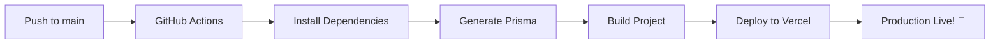

# 🚀 Deployment Guide - GitHub Actions → Vercel

This guide will help you set up automatic deployments to Vercel when you push code to GitHub.

---

## 📋 Prerequisites

1. ✅ GitHub repository
2. ✅ Vercel account (free)
3. ✅ Your FarmCon project

---

## ⚙️ Setup Steps

### Step 1: Get Vercel Tokens

#### 1.1 Get Vercel Token
1. Go to https://vercel.com/account/tokens
2. Click **"Create Token"**
3. Name: `GitHub Actions`
4. Scope: `Full Access`
5. Copy the token (you'll only see it once!)

#### 1.2 Get Vercel Project IDs
```bash
# Install Vercel CLI
npm install -g vercel

# Login to Vercel
vercel login

# Link your project (run in project directory)
vercel link

# This creates .vercel/project.json with your IDs
```

Open `.vercel/project.json` and copy:
- `orgId` → This is your **VERCEL_ORG_ID**
- `projectId` → This is your **VERCEL_PROJECT_ID**


---

### Step 2: Add GitHub Secrets

1. Go to your GitHub repository
2. Click **Settings** → **Secrets and variables** → **Actions**
3. Click **New repository secret**

Add these secrets:

| Secret Name | Value | Where to Get |
|------------|-------|--------------|
| `VERCEL_TOKEN` | Your Vercel token | Step 1.1 |
| `VERCEL_ORG_ID` | Your org ID | `.vercel/project.json` |
| `VERCEL_PROJECT_ID` | Your project ID | `.vercel/project.json` |
| `DATABASE_URL` | Your database URL | `.env` file |
| `NEXT_PUBLIC_SUPABASE_URL` | Supabase URL | `.env` file |
| `NEXT_PUBLIC_SUPABASE_ANON_KEY` | Supabase key | `.env` file |
| `UPSTASH_REDIS_REST_URL` | Redis URL | `.env` file |
| `UPSTASH_REDIS_REST_TOKEN` | Redis token | `.env` file |

**Optional but recommended:**
| Secret Name | Value |
|------------|-------|
| `STRIPE_SECRET_KEY` | Stripe secret key |
| `EMAIL_PASSWORD` | Email password |
| `CLOUDINARY_API_SECRET` | Cloudinary secret |
| `NEXT_PUBLIC_POSTHOG_KEY` | PostHog key |
| `MEILISEARCH_API_KEY` | MeiliSearch key |
| `RECAPTCHA_SECRET_KEY` | reCAPTCHA secret |

---

### Step 3: Verify GitHub Action

The GitHub Action (`.github/workflows/deploy.yml`) is already created!

What it does:
- ✅ **On push to `main`** → Deploy to production
- ✅ **On pull request** → Deploy preview
- ✅ Runs tests
- ✅ Generates Prisma client
- ✅ Builds the project
- ✅ Deploys to Vercel

---

### Step 4: Test the Deployment

#### Option 1: Push to Main
```bash
# Make a small change
echo "# Test deployment" >> README.md

# Commit and push
git add .
git commit -m "test: trigger deployment"
git push origin main
```

#### Option 2: Create Pull Request
```bash
# Create a new branch
git checkout -b test-deployment

# Make a change
echo "# Test PR deployment" >> README.md

# Commit and push
git add .
git commit -m "test: PR deployment"
git push origin test-deployment

# Create PR on GitHub
```

---

### Step 5: Monitor Deployment

1. **GitHub Actions Tab**
   - Go to your repo → **Actions** tab
   - You'll see the workflow running
   - Click on it to see logs

2. **Vercel Dashboard**
   - Go to https://vercel.com/dashboard
   - Click on your project
   - See deployment progress

3. **Get Deployment URL**
   - Production: `https://your-project.vercel.app`
   - Preview: GitHub will comment on your PR with URL

---

## 🔍 Troubleshooting

### Build Fails?

#### Check Secrets
Make sure all required secrets are added:
```bash
# Required secrets:
- VERCEL_TOKEN
- VERCEL_ORG_ID
- VERCEL_PROJECT_ID
- DATABASE_URL
- NEXT_PUBLIC_SUPABASE_URL
- NEXT_PUBLIC_SUPABASE_ANON_KEY
```

#### Check Logs
1. Go to Actions tab
2. Click on failed workflow
3. Expand the failed step
4. Read error message

Common errors:
- **"Prisma Client not generated"** → Check DATABASE_URL secret
- **"Build failed"** → Check all environment variables
- **"Unauthorized"** → Check VERCEL_TOKEN

---

### Deployment Succeeds but App Doesn't Work?

#### Add Environment Variables in Vercel Dashboard

Even though GitHub Actions has secrets, Vercel also needs them:

1. Go to https://vercel.com/dashboard
2. Click your project
3. Go to **Settings** → **Environment Variables**
4. Add all variables from your `.env` file

**Important:** Add for all environments:
- ✅ Production
- ✅ Preview
- ✅ Development

Click **Save** and **Redeploy**.

---

## 🎯 Advanced Configuration

### Custom Domain

1. Go to Vercel Dashboard → Your Project
2. Click **Settings** → **Domains**
3. Add your domain (e.g., `farmcon.com`)
4. Update DNS records as shown
5. Wait for SSL certificate (automatic)

### Environment-Specific Variables

```yaml
# .github/workflows/deploy.yml

# Add different variables for preview vs production
- name: Deploy to Vercel (Production)
  env:
    DATABASE_URL: ${{ secrets.PROD_DATABASE_URL }}

- name: Deploy to Vercel (Preview)
  env:
    DATABASE_URL: ${{ secrets.DEV_DATABASE_URL }}
```

### Deploy on Tag

```yaml
# Only deploy when creating a release tag
on:
  push:
    tags:
      - 'v*'
```

---

## 📊 Deployment Workflow



---

## ✅ Checklist

Before pushing to production:

- [ ] All GitHub secrets added
- [ ] All Vercel environment variables added
- [ ] Database is accessible from Vercel
- [ ] Redis is accessible from Vercel
- [ ] Stripe webhooks point to production URL
- [ ] Email sending works in production
- [ ] Cloudinary configured
- [ ] PostHog configured (optional)
- [ ] MeiliSearch accessible (optional)
- [ ] Domain configured (optional)

---

## 🔐 Security Best Practices

### 1. Use Environment Variables
Never commit secrets to Git:
```bash
# Add to .gitignore (already done)
.env
.env.local
.vercel
```

### 2. Rotate Tokens Regularly
- Change Vercel token every 90 days
- Update GitHub secret when changed

### 3. Use Different Databases
- **Production**: Supabase production instance
- **Preview**: Supabase staging instance
- **Development**: Local or dev instance

### 4. Enable Vercel Protection
1. Go to Vercel → Settings → General
2. Enable **Vercel Authentication**
3. Protect preview deployments

---

## 🚀 Quick Commands

### Manual Deployment
```bash
# Deploy to production
vercel --prod

# Deploy to preview
vercel
```

### View Deployments
```bash
# List all deployments
vercel ls

# View logs
vercel logs
```

### Rollback
```bash
# List deployments
vercel ls

# Rollback to previous
vercel rollback [deployment-url]
```

---

## 📈 Monitoring

### Vercel Analytics
1. Go to Vercel Dashboard → Your Project
2. Click **Analytics**
3. View:
   - Page views
   - Top pages
   - Top referrers
   - Real User Metrics (RUM)

### GitHub Actions Status Badge

Add to README.md:
```markdown

```

---

## 💡 Tips

### Faster Deployments
1. **Use npm ci** instead of npm install (already done)
2. **Cache node_modules** (already configured)
3. **Only build when needed** (GitHub Actions checks this)

### Preview Deployments
Every PR gets a unique preview URL:
- Test features before merging
- Share with team for review
- Automatic cleanup after merge

### Automatic Database Migrations
Add to workflow:
```yaml
- name: Run Prisma Migrations
  run: npx prisma migrate deploy
  env:
    DATABASE_URL: ${{ secrets.DATABASE_URL }}
```

---

## 🆘 Support

### GitHub Actions Issues
- Check: https://github.com/YOUR_USERNAME/farmcon/actions
- Logs: Click on failed workflow → View logs

### Vercel Issues
- Dashboard: https://vercel.com/dashboard
- Support: https://vercel.com/support
- Docs: https://vercel.com/docs

### Still Stuck?
1. Check Vercel logs: `vercel logs`
2. Check GitHub Actions logs
3. Verify all secrets are correct
4. Try manual deployment: `vercel --prod`

---

## 🎉 Success!

Once set up, your deployment workflow:

1. ✅ **Code** → Push to GitHub
2. ✅ **Build** → GitHub Actions automatically builds
3. ✅ **Deploy** → Vercel automatically deploys
4. ✅ **Live** → Your app is live in ~2 minutes!

**No manual deployment needed ever again!** 🚀

---

**Happy Deploying!** 🌾
